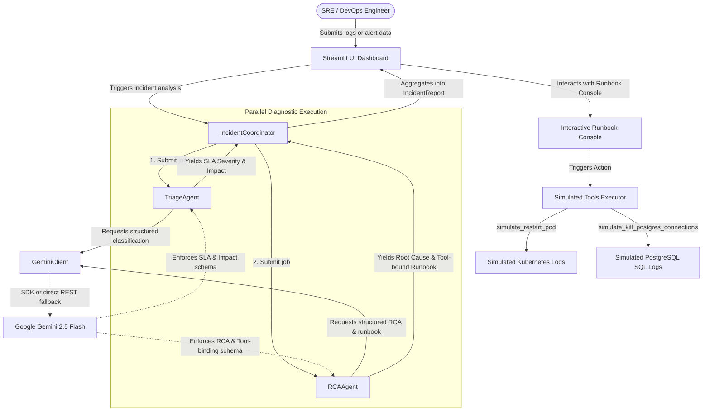

# 🚀 IncidentPilot: AI-Powered DevOps Incident Response Multi-Agent System

IncidentPilot is an enterprise-grade, autonomous DevOps incident response platform. It dramatically reduces **Mean Time to Resolution (MTTR)** by ingesting raw, chaotic logs and alerts and instantly transforming them into structured, actionable, and safe incident reports.

---

## 🗺️ System Architecture

The following diagram illustrates how the `IncidentCoordinator` orchestrates sub-agents, interfaces with the Google Gemini API, and dispatches interactive recovery tools:



---

## 🎓 Capstone Justification (Google's 3 Pillars)

This project has been built in accordance with the core principles of Google's AI Agent framework, satisfying all three fundamental pillars:

### 1. 🤖 Multi-Agent Systems (Orchestration & Concurrency)
Instead of relying on a single large prompt, the system segregates responsibilities between two specialized agents coordinated by the [`IncidentCoordinator`](./incidentpilot/app/coordinator.py):
*   **`TriageAgent`:** Assesses SLA severity levels (P1, P2, P3) and drafts concise business impact summaries.
*   **`RCAAgent`:** Analyzes logs to determine technical root causes and generates sequence runbooks.
*   **Concurrency Model:** To slash latency, both agents execute concurrently using Python's `ThreadPoolExecutor` workers, parsing structured inputs against structured outputs via Google Gemini `gemini-2.5-flash`.

### 2. 🔧 Agent Skills (Interactive Simulated Tools)
Rather than producing static documentation, agents are equipped with actionable execution "skills" defined in [`tools.py`](./incidentpilot/app/core/tools.py):
*   Runbook steps automatically bind to specific simulation routines (e.g., `simulate_restart_pod` or `simulate_kill_postgres_connections`).
*   Within the Streamlit UI dashboard, DevOps engineers can interactively execute these tools by clicking the **🔧 Run Action** buttons.
*   The dashboard opens a live stdout console streaming simulated container state transitions and SQL database queries.

### 3. 🛡️ Safety & Governance (Guardrail Isolation)
To guarantee compliance and safety during production incident triage, a rigid guardrails layout is configured directly inside the [`RCAAgent`](./incidentpilot/app/agents/rca_agent.py) prompt and validated programmatically:
*   **Sensitive Data Sanitization:** Any API keys, access tokens, credentials, or connection strings detected in raw stack traces are automatically masked using the `<REDACTED_SECRET>` tag.
*   **Destructive Command Interception:** Dangerous actions (like unconstrained `rm -rf` or SQL `DROP DATABASE`) are immediately caught, marked with `<REQUIRES_MANUAL_REVIEW>`, and mapped to the `manual` tool execution block, enforcing a Human-in-the-Loop gate.

---

## 📂 Project Structure

```
IncidentPilot/
│
├── .env.example             # Template for local environment variables
├── .gitignore               # Safe Git exclusions
├── requirements.txt         # Project dependencies list
├── README.md                # Main project document
├── README_SKILLS.md         # Guide to local AI Agent skills
│
├── docs/                    # Architectural specs and PRD docs
│   ├── safety_governance.md
│   ├── architecture_optimization.md
│   └── agents/
│       ├── specs.md
│       └── specs_deliberation_mitigation.md
│
└── incidentpilot/           # Source code
    └── app/
        ├── streamlit_app.py # Streamlit UI Dashboard
        ├── coordinator.py   # Coordinator orchestrator
        ├── agents/
        │   ├── triage_agent.py
        │   └── rca_agent.py
        └── core/
            ├── gemini_client.py # Gemini API interface with REST fallback
            ├── schemas.py       # Pydantic v2 validation models
            └── tools.py         # Mock CLI tools implementation
```

---

## 🏃 Quick Installation & Setup

Follow these steps to set up and run the application locally:

### 1. Clone the Repository
```bash
git clone https://github.com/your-username/IncidentPilot.git
cd IncidentPilot
```

### 2. Install Project Dependencies
Use Python 3.10 or higher. Install all required dependencies from [`requirements.txt`](./requirements.txt):
```bash
pip install -r requirements.txt
```

### 3. Configure Local Environment
Copy [`.env.example`](./.env.example) to `.env` in the root folder:
```bash
cp .env.example .env
```
Open `.env` and configure your API key:
```env
GEMINI_API_KEY=your_actual_gemini_api_key
```
*(You can obtain a free API key at [Google AI Studio](https://aistudio.google.com/))*

### 4. Run the Streamlit Dashboard
Launch the app with Streamlit:
```bash
streamlit run incidentpilot/app/streamlit_app.py
```

### 5. Start Triage and RCA Simulation
1. Access the web dashboard (default is `http://localhost:8501`).
2. Load a template incident from the sidebar dropdown (e.g., **"Kubernetes Pod OOMKilled Outage"**).
3. Click **Analyze Incident with Agents** to launch the diagnosis.
4. Interact with the compiled runbook and run remediation steps using the **🔧 Run Action** buttons.
