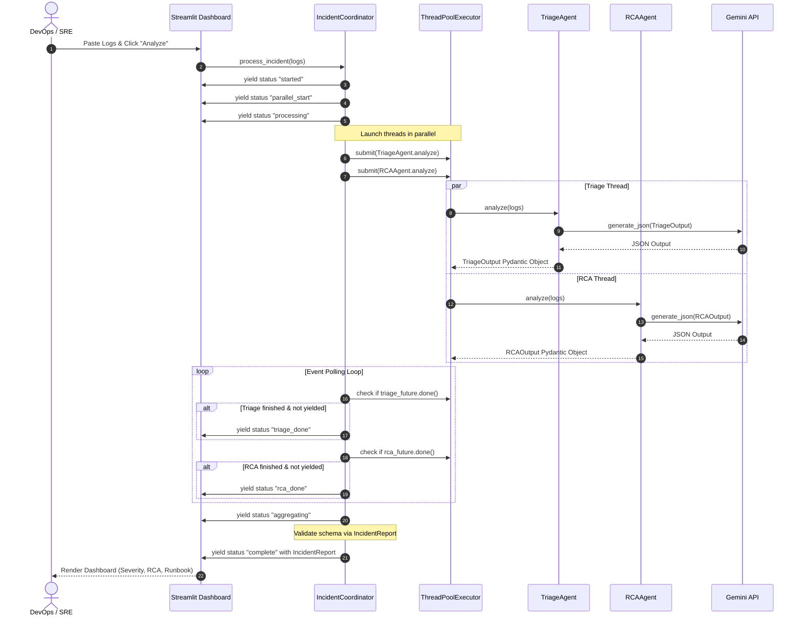

# IncidentPilot Performance Optimization Architecture

This document specifies the architectural changes implemented to optimize the performance and reduce the latency of **IncidentPilot**, utilizing the `architect` skill.

---

## 1. Multi-Agent Orchestration & Concurrency Model

During an incident, the **Triage Agent** (severity classification and business impact) and the **RCA Agent** (technical root cause and runbook tool mapping) perform independent analytical tasks on the input data. Executing these calls sequentially resulted in twice the latency (waiting for two sequential Gemini API requests).

To resolve this, we introduced a concurrent execution model using a `ThreadPoolExecutor` since the underling `GeminiClient` runs synchronous HTTP requests.

### 1.1 Mermaid Sequence Diagram



---

## 2. Technology Stack

*   **User Interface**: [Streamlit (v1.30+)](https://streamlit.io/) for high-fidelity interactive frontend components.
*   **Concurrency Engine**: [Python `concurrent.futures.ThreadPoolExecutor`](https://docs.python.org/3/library/concurrent.futures.html) for executing I/O-bound LLM tasks in parallel threads.
*   **Model Schemas**: [Pydantic v2](https://docs.pydantic.dev/latest/) for data parsing, validation, and serialization.
*   **LLM API Client**: `google-genai` SDK with direct `requests` HTTP fallback.

---

## 3. Data Flow Walkthrough

1.  **Ingestion**: SRE enters raw log outputs or monitoring alerts into the Streamlit dashboard and triggers analysis.
2.  **Initialization**: The coordinator initializes, yields a start event, and sets up a `ThreadPoolExecutor` with a maximum of 2 workers.
3.  **Concurrent Processing**:
    *   **Thread 1** executes `TriageAgent.analyze(incident_input)` which invokes Gemini with the triage prompt and parses the result into `TriageOutput`.
    *   **Thread 2** executes `RCAAgent.analyze(incident_input)` which invokes Gemini with the RCA prompt and parses the result into `RCAOutput`.
4.  **UI Updates**: A generator polling loop checks if threads have finished. As each thread finishes, it yields its respective state to Streamlit. If a thread fails, its exception is captured and a structured error state is yielded to prevent UI hanging.
5.  **Aggregation**: The results of both threads are consolidated into `IncidentReport` where Pydantic checks fields types and constraints.
6.  **Resolution Rendering**: The dashboard updates with the final incident severity, root cause description, and step-by-step interactive runbook.

---

## 4. Historical Reporting Schema (DDL)

To persist incident reports generated by the concurrent multi-agent flow, the following database schema is proposed:

```sql
-- Represents an individual incident diagnosis session
CREATE TABLE incidents (
    id UUID PRIMARY KEY DEFAULT gen_random_uuid(),
    created_at TIMESTAMP WITH TIME ZONE DEFAULT CURRENT_TIMESTAMP,
    incident_input TEXT NOT NULL,
    severity VARCHAR(10) NOT NULL CHECK (severity IN ('P1', 'P2', 'P3')),
    business_impact TEXT NOT NULL,
    root_cause TEXT NOT NULL,
    confidence NUMERIC(3, 2) NOT NULL CHECK (confidence BETWEEN 0.0 AND 1.0)
);

-- Represents individual runbook mitigation steps mapped by the RCA agent
CREATE TABLE runbook_steps (
    id UUID PRIMARY KEY DEFAULT gen_random_uuid(),
    incident_id UUID REFERENCES incidents(id) ON DELETE CASCADE,
    step_number INTEGER NOT NULL,
    instruction TEXT NOT NULL,
    tool_name VARCHAR(100), -- e.g., 'simulate_restart_pod' or NULL
    tool_parameters JSONB,   -- e.g., '{"pod_name": "payment-api"}'
    UNIQUE (incident_id, step_number)
);
```

---

## 5. Security Audit Matrix

| Risk Identified | Description | Mitigation Pattern |
| :--- | :--- | :--- |
| **Destructive Command Execution** | Recommended automated tool calls (e.g., pod restarts) executing immediately. | **Human Approval Gate**: Runbook actions require the SRE to explicitly click `🔧 Run Action` in the UI; agents cannot execute mutating actions autonomously. |
| **Credential & API Key Leaks** | Exposing `GEMINI_API_KEY` to frontend or git repository. | **Token Isolation**: The key is stored in a local `.env` file (which is gitignored) and loaded securely via `python-dotenv`. |
| **Model Invalidation Attacks** | Malicious logs injecting prompt guidelines causing the agents to bypass safety checks. | **Schema Enforce Validation**: We strictly enforce Pydantic parsing at both agent and coordinator levels. Any payload not conforming to `TriageOutput` or `RCAOutput` fails validation immediately. |
| **Thread Over-allocation** | High user traffic creating too many threads and starving CPU resources. | **Bounded Thread Pool**: Thread pools are localized and constrained strictly to 2 worker threads per request, preventing CPU/memory exhaustion. |
