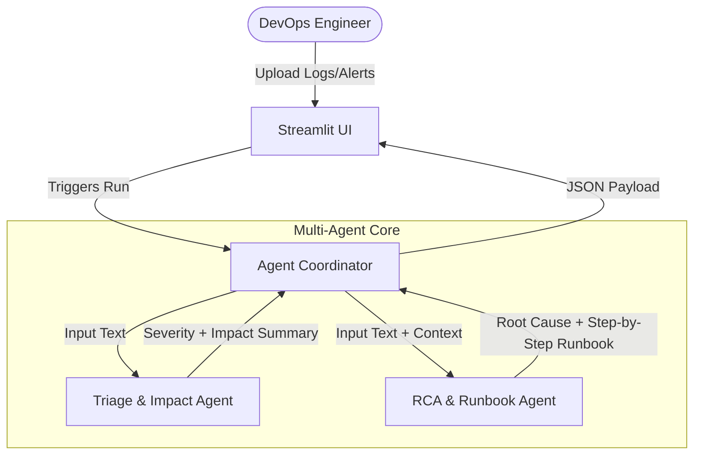

# Product Requirements Document (PRD) — IncidentPilot MVP

## 1. Metadata
*   **Status**: Draft
*   **Author**: Antigravity/Gemini (following the `to-prd` skill)
*   **Target Systems**: Streamlit Dashboard, Python-based Multi-Agent Orchestrator
*   **Created**: 2026-06-22

---

## 2. Executive Summary & User Goals
IncidentPilot is an AI-powered DevOps Incident Response system designed for on-call DevOps/SRE engineers. DevOps teams are regularly overwhelmed with noisy alerts, raw logs, and unstructured text descriptions during critical outages. 

The goal of this MVP is to ingest these mixed inputs, automatically classify the incident severity, summarize the impact, perform root-cause analysis (RCA), and generate a step-by-step runbook for remediation. The results will be presented in a clean, interactive Streamlit dashboard.

---

## 3. Core Problem & User Stories
During an incident, SREs waste critical minutes context-switching between monitoring tools to triage and find the appropriate runbook.

### User Stories:
1.  **As a DevOps Engineer**, I want to paste raw log dumps or Slack alert texts into a UI so that I don't have to read hundreds of lines of raw text manually during a high-pressure incident.
2.  **As an Incident Responder**, I want to receive an immediate severity classification (P1/P2/P3) and impact summary so that I can notify stakeholders and follow the right escalation path.
3.  **As a Troubleshooting Engineer**, I want to see a clear Root Cause Analysis and a step-by-step mitigation runbook so that I can resolve the issue quickly and safely.

---

## 4. Multi-Agent & System Scope
To keep the MVP lightweight and avoid overengineering, we define a two-agent architecture coordinated by a lightweight controller:

### Agent Roles:
1.  **Triage Agent**:
    *   **Focus**: Analyzing severity (P1/P2/P3) and determining the immediate scope of impact (e.g., database downtime, single API failure, internal network latency).
2.  **RCA & Runbook Agent**:
    *   **Focus**: Deep analysis of logs/alerts to pinpoint the root cause (e.g., out-of-memory error, DB lock contention) and drafting a chronological, step-by-step runbook to resolve it.

---

## 5. Functional Requirements

| ID | Requirement | Severity | Observability/Logs Required |
| :--- | :--- | :--- | :--- |
| **FR-1** | User must be able to upload log files (.txt, .log) or paste raw text alerts. | Must | Streamlit logs for file input sizes. |
| **FR-2** | Triage Agent must classify severity into P1 (critical outage), P2 (major degradation), or P3 (minor issue). | Must | LLM latency and prompt tokens tracked. |
| **FR-3** | Triage Agent must generate a 2-3 sentence business impact summary. | Must | LLM response token length. |
| **FR-4** | RCA Agent must analyze inputs and produce a root cause statement. | Must | LLM output parsing logs. |
| **FR-5** | RCA Agent must generate an actionable, step-by-step markdown runbook. | Must | Runbook markdown format validation. |
| **FR-6** | Streamlit Dashboard must display Severity, Impact, RCA, and Runbook in separate tabs or expanders. | Must | Frontend render logs. |

---

## 6. Non-Functional Requirements

### Security & Sandboxing:
*   The MVP is **read-only/interactive advisor mode**: it recommends actions in the runbook but does *not* execute commands directly on the production system. This minimizes security risks during the initial release.
*   Data submitted to the LLM must be stripped of potential API keys/secrets locally (optional/simplistic Regex sanitizer in helper script).

### SLA & Timeouts:
*   The entire multi-agent orchestration must complete in under **10 seconds** to ensure usefulness during live incidents.

### Rate Limiting & Cost Control:
*   Limit input text to a maximum of 50,000 characters to prevent high LLM token costs.

---

## 7. Observability & Success Metrics
*   **Observability**: Maintain structured JSON logs for each run containing:
    *   Prompt token counts, completion token counts, and execution duration.
    *   Categorized failure cases (e.g., "LLM parsing error", "File format error").
*   **Success Metrics**:
    *   ** Triaging Accuracy**: >80% accuracy matching human incident classifications on sample datasets.
    *   **Response Speed**: Average processing time <5s.
